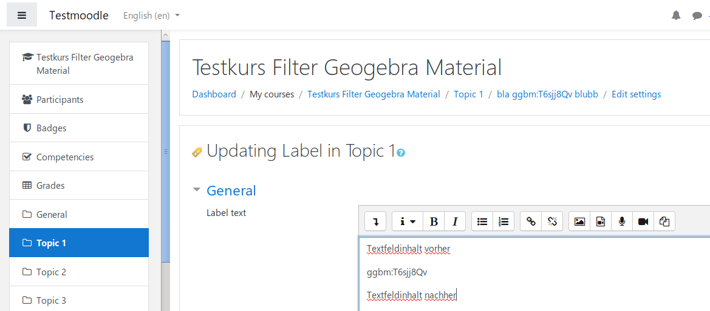
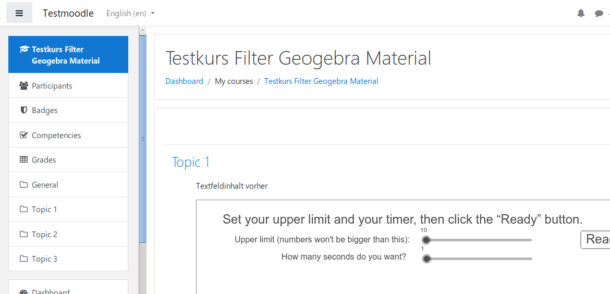

# GeoGebra Material filter

## filter_ggbm

Moodle Filter Plugin which replaces the wildcard **ggbm:MATERIALID** with the iframe embedding-Code for this GeoGebra Material in any Moodle activity or textblock.

Example:

`ggbm:T6sjj8Qv` 

will be replaced with:

`<iframe scrolling="no"  class="ggbm_filter_iframe" src="https://www.geogebra.org/material/iframe/id/T6sjj8Qv/width/640/height/480/border/888888/smb/false/stb/false/stbh/false/ai/false/asb/false/sri/true/rc/true/ld/false/sdz/true/ctl/true/sfsb/true" width="640px" height="480px" style="border:0px;" allowfullscreen></iframe>`

  * [Joachim Jakob, 2018](https://quizdidaktik.de/moodle_plugins/)
  
  
  

